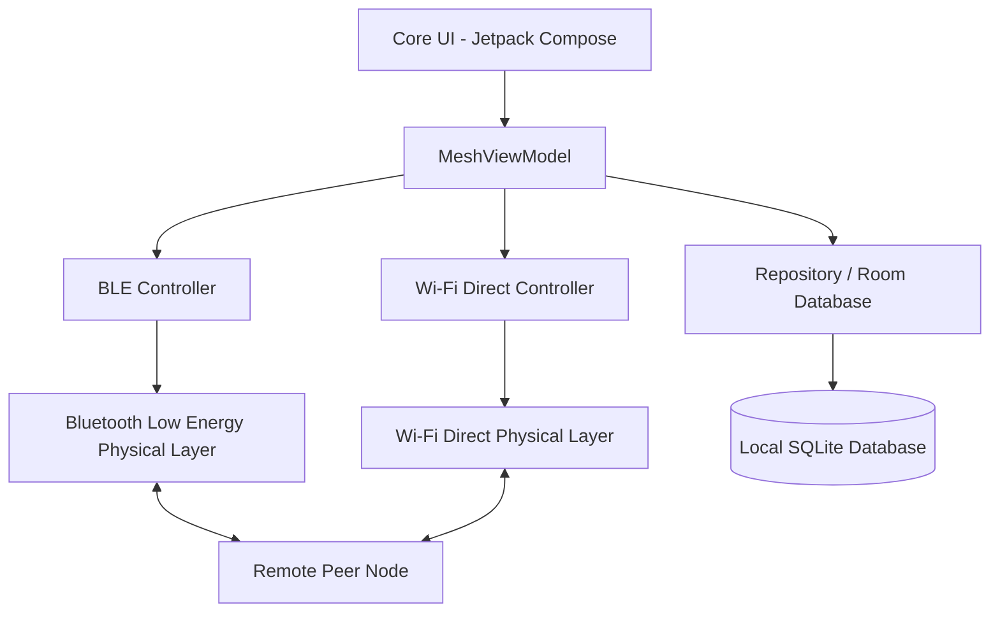

# NEXUS MESH (v7.0) — Off-Grid Decentralized Mesh Networking Protocol

[](https://github.com/nexus-mesh/nexus-mesh-android/actions/workflows/android.yml)
[](LICENSE)
[](SUPPORTED_DEVICES.md)
[](CRYPTOGRAPHY.md)

NEXUS MESH is a resilient, fully decentralized, peer-to-peer (P2P) ad-hoc mesh networking protocol and Android application designed for high-density, off-grid environments where cellular and internet infrastructure are unavailable. It orchestrates zero-infrastructure communication utilizing multi-hop Bluetooth Low Energy (BLE) routing, Wi-Fi Direct (P2P) high-throughput carrier links, and cryptographic identity derivation.

---

## Project Overview

In emergencies, crowded music festivals, remote research expeditions, or areas lacking cellular service, current mobile devices become isolated islands. NEXUS MESH bridges this gap. By turning every participating Android device into a routing node, it constructs a dynamic, self-healing mesh topology. 

Unlike traditional centralized services, NEXUS MESH requires **no central servers, cellular towers, or internet handshakes**.

---

## Key Features

- **Dynamic Multi-Hop Routing**: Self-healing pathfinding over BLE advertisement payloads and active GATT connections.
- **Hybrid Physical Carriers**: Orchestrated BLE for low-latency control-plane beaconing paired with high-bandwidth Wi-Fi Direct for data-plane bulk transfers (firmware, media, datasets).
- **ZKP Identity Derivation**: Cryptographic keypairs generated directly from offline 12-word recovery seed phrases, featuring zero-knowledge authentication challenges.
- **Zero-Trust Security**: Point-to-point encryption utilizing ECDH key exchanges and AES-GCM-256 envelope security.
- **Offline Social Feed & Stories**: Dispersed transient social posts (ephemeral Mesh Stories with 24-hour expiry) backed by a fully local, thread-safe Room SQLite database.
- **Smart Energy Governor**: Battery-aware telemetry that dynamically disables message-relaying on low-battery nodes (<20%) or forces high-throughput relay capabilities during active charging.

---

## Supported Android Versions

- **Minimum SDK**: API Level 26 (Android 8.0 Oreo) - Required for stable BLE advertising and BluetoothGattServer APIs.
- **Target SDK**: API Level 34 (Android 14) - Fully compliant with precise background execution policies and Bluetooth runtime permissions.

---

## Current Development Status

- **Core Protocol**: Implemented & Verified (V2.1 specification).
- **Local Persistence Layer**: Fully Implemented (Room SQLite Engine).
- **Wi-Fi Direct Transport**: Experimental/Validated under simulated high-density environments.
- **Zero-Knowledge Challenges**: Planned for integration in v7.1.

---

## Architecture Diagram



---

## Technology Stack

- **UI Framework**: Jetpack Compose (Material Design 3 Theme)
- **Programming Language**: Kotlin (Coroutines, Flow, StateFlow)
- **Local Database**: Android Room (with SQLite, KSP compiler)
- **Core Networking**: Android Bluetooth LE API & Wi-Fi P2P (Wi-Fi Direct) Framework
- **Cryptography**: Tink / Android Keystore System
- **Build System**: Gradle Kotlin DSL

---

## Quick Start

### Installation

Clone the repository and import the project into Android Studio:

```bash
git clone https://github.com/nexus-mesh/nexus-mesh-android.git
```

### Permissions Required

NEXUS MESH requires explicit permission grants to enable offline peer discovery:
- `android.permission.BLUETOOTH_SCAN`
- `android.permission.BLUETOOTH_ADVERTISE`
- `android.permission.BLUETOOTH_CONNECT`
- `android.permission.ACCESS_FINE_LOCATION`
- `android.permission.NEARBY_WIFI_DEVICES` (for Android 13+)

---

## Building from Source

To compile the application debug build, execute the following Gradle task:

```bash
gradle assembleDebug
```

---

## Running Tests

To run local JVM tests containing simulated peer topologies, execute:

```bash
gradle :app:testDebugUnitTest
```

---

## Developer Documentation

Refer to the complete offline-first engineering guides in the root directory:
- [Developer Quick Start](README_DEV.md)
- [Protocol Specification](NETWORK_PROTOCOL.md)
- [Cryptographic Specifications](CRYPTOGRAPHY.md)
- [Database Engine Guide](DATABASE.md)

---

## Security Model

NEXUS MESH assumes a completely adversarial network environment. Every packet is signed, time-stamped, and verified. Key highlights include:
1. **Dynamic MAC Randomization** to prevent physical tracking of hardware.
2. **Ephemeral ECDH session keys** to prevent global passive decryption.
3. **ZKP Reputation Validation** to mitigate Sybil and Eclipse routing attacks.

---

## Known Limitations

- High RF congestion (cluttered 2.4 GHz spectrum) degrades BLE packet delivery.
- Background execution limits on non-stock Android OEMs (Samsung, Xiaomi) may aggressively sleep GATT connections.
- See [Known Limitations](KNOWN_LIMITATIONS.md) for remediation configurations.

---

## Roadmap

- **v7.1**: Real-world hardware test harness validations.
- **v7.2**: Interoperable iOS core client via Swift CoreBluetooth wrapper.
- **v8.0**: Satellite backup transit gateways.

---

## License

This project is licensed under the Apache License, Version 2.0. See the [LICENSE](LICENSE) file for details.

---

## FAQ

Please refer to the comprehensive [README_FAQ.md](README_FAQ.md) for troubleshooting, battery utilization optimization questions, and hardware routing quirks.

---

## Acknowledgements

- Google AndroidX Teams (Jetpack Compose, Room)
- LibP2P Peer-to-Peer Protocol Consortium
- Signal Foundation (Double Ratchet concepts)
- Matrix.org (Decentralized state replication)