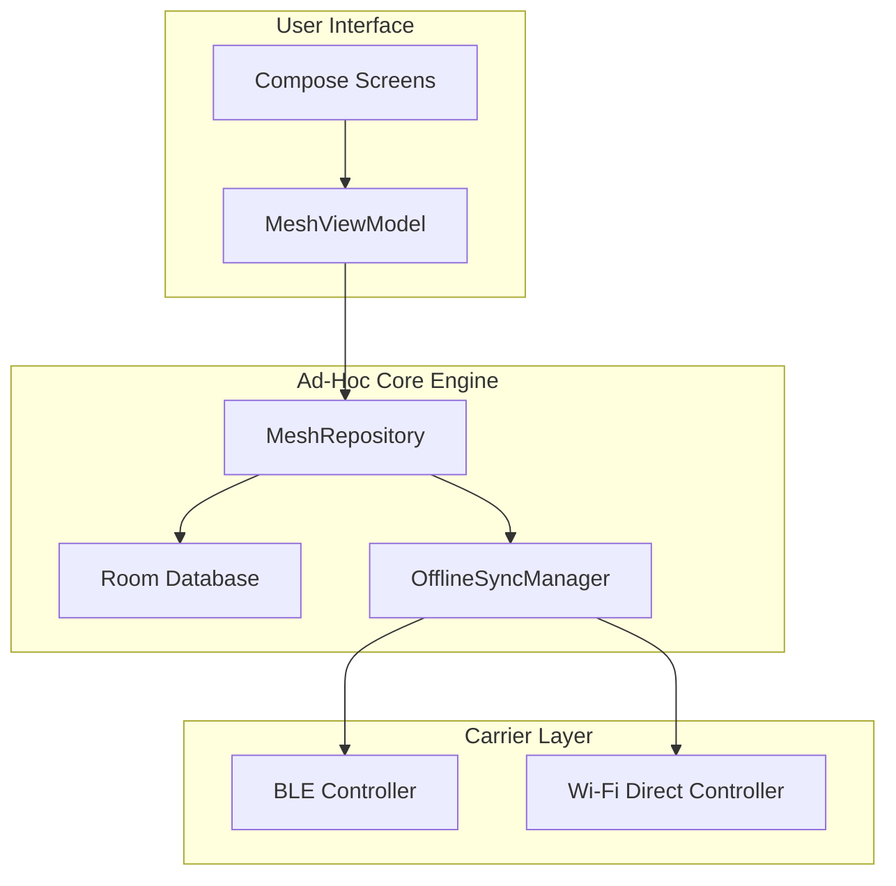

# System Architecture & Subsystems Specification

## Purpose
Establishes the macro-architecture, module bounds, class relationships, and data pipelines powering the NEXUS MESH ad-hoc decentralization engine.

## Scope
Documents the MVVM architecture, database entities, repository sync layers, Bluetooth control loops, and Wi-Fi Direct data pipes.

## Background
Standard Android P2P connections are transient and fragile. NEXUS MESH implements a reliable transport wrapper utilizing local transaction caching and eventual consistency paradigms.

## Architecture Diagram

## Subsystem Breakdown
1. **MeshViewModel**: Exposes state variables (`MutableStateFlow`) containing reactive database feeds.
2. **Room Database**: Enforces transactional integrity for messages, nodes, and local telemetry.
3. **BLE Controller**: Manages periodic BLE scanning and advertisements containing identity hashes.
4. **Wi-Fi Direct Controller**: Orchestrates high-speed socket transfers for massive payloads.

## Implementation Details
The synchronization process uses a Gossip-style metadata exchange. Scanned nodes exchange bloom filters to quickly identify missing data packets.

## Future Work
Transition core protocol parsing into a multiplatform Kotlin Multiplatform (KMP) module.

## Revision History
- **v1.0.0 (2026-06-26)**: Initial documentation of decentralized sub-systems.